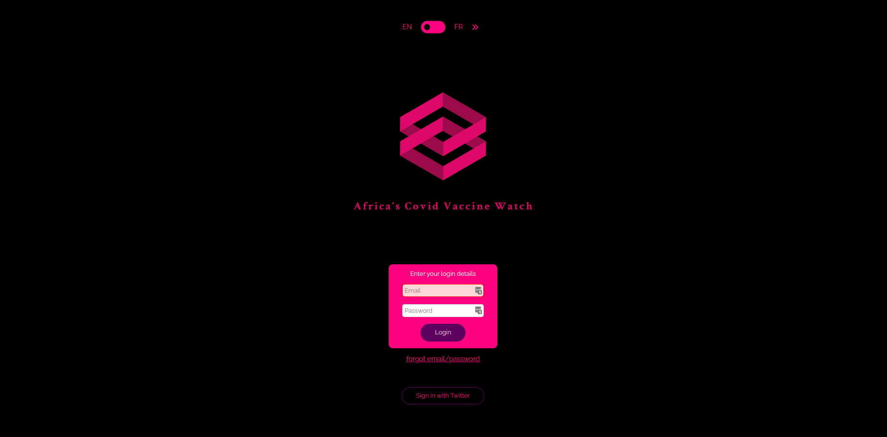
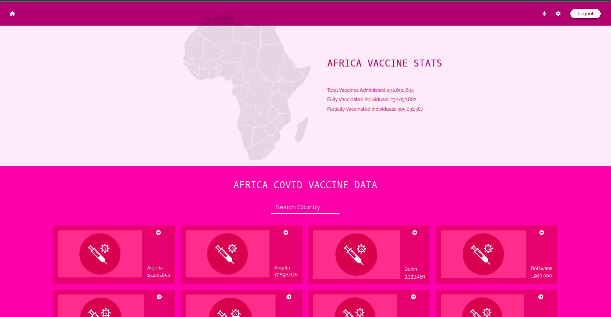
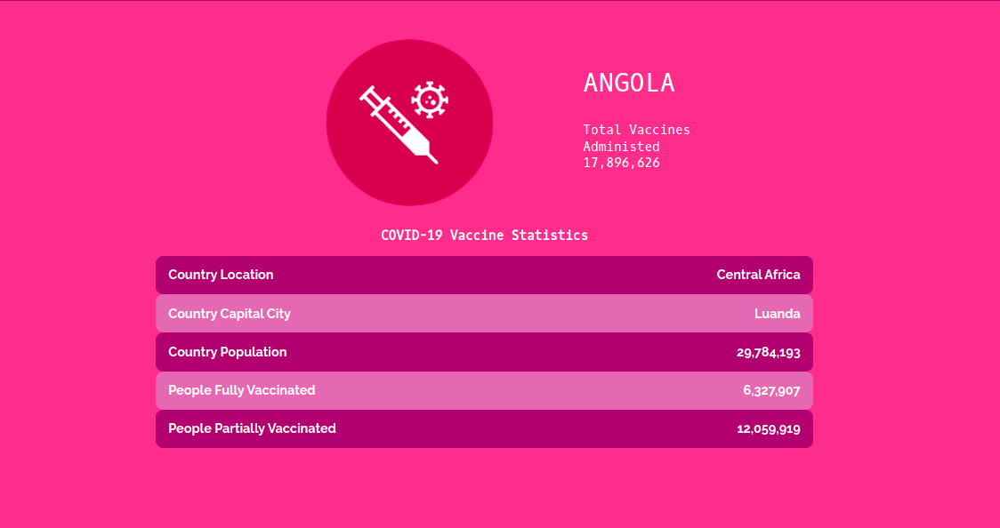

## Preview

Login Page

Home Page

Country Page

<h1 align="center">Covid Vaccines</h1>

> A mobile web application that collects information from an API to provide comprehensive data for the novel coronavirus in Africa. Real live data is obtained from the MMediaGroup API.

## Live Link

[African Covid Vaccination](https://african-covidvaccine.netlify.app/)

## Demo Video

[React Capstone Presentation](https://www.loom.com/share/8ea96c9066c44e58847303e08e739aae)

## Built With

- **REACT** and **CSS** and **Javascript**

## Getting Started

To get a local copy up and running follow these setup steps below.

### Setup

- Simply fork this project
- run `npm install `to install all dependencies
- run `npm start` to launch the application
- Run `npm test` to run all tests.

## Authors

- GitHub: [@Mikelobi](https://github.com/Mikelobi) - Follow me on Github, browse my projects, and leave a star for any project you like.
- Twitter: [@Mikelobi](https://twitter.com/@omulum) - Follow me on Twitter I will make your Timeline a bit more interesting
- LinkedIn: LinkedIn: [@Mikelobi](https://linkedin.com/in/omulu) - Connect with me on LinkedIn and help each other grow professionally

## 🤝 Contributing

Contributions, issues, and feature requests are welcome!

Feel free to check the [issues page](https://github.com/Mikelobi/Covid-Vaccine/issues) to raise any issues or make a feature request.

## Show your support

Give a ⭐️ if you like this project!

## Acknowledgments
- Learning partners, Standup and morning session team
- [Nelson Sakwa on Behance](https://www.behance.net/sakwadesignstudio) (Project Design from [Behance](https://www.behance.net/gallery/31579789/Ballhead-App-(Free-PSDs)))
- [M-Media-Group/Covid-19-API](https://github.com/M-Media-Group/Covid-19-API)

## 📝 License

This project is [MIT](https://opensource.org/licenses/MIT) licensed.
